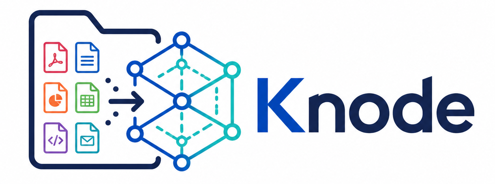
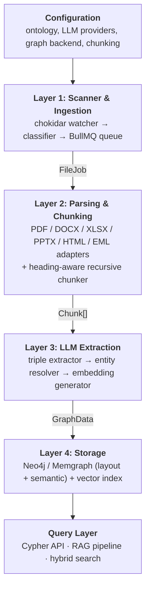

# Knode


<p align="center">
  
</p>

> Built with [Claude](https://claude.com) — this project was designed and implemented in collaboration with Anthropic's Claude.

A filesystem-to-knowledge-graph pipeline. Knode watches a folder of heterogeneous documents (PDF, DOCX, PPTX, XLSX, HTML, EML), extracts entities and relationships using LLMs, and persists the result as a dual **layout + semantic** knowledge graph in Neo4j. The graph is queryable via Cypher for exploration and via a RAG pipeline for LLM-augmented question answering grounded in the source corpus.

The system is built on five principles: **modularity** (every layer is interface-driven and swappable), **provenance** (every fact traces back to a specific location in a specific document), **incremental processing** (re-runs only touch changed files), **cost-aware LLMusage** (tiered models, batching, budgets), and **TypeScript end-to-end** (no polyglot deployment).

## What Knode does

- Watches a directory tree for added, changed, and removed documents
- Parses PDF, DOCX, PPTX, XLSX, HTML, and `.eml` into structured chunks with full metadata (page numbers, heading hierarchy, byte offsets)
- Extracts entities and relationships per chunk with a configurable LLM provider (Anthropic, OpenAI, or Ollama via the Vercel AI SDK)
- Resolves duplicate entities across documents (e.g., "Apple Inc." and "Apple" collapse to one node)
- Generates vector embeddings for every node and chunk
- Persists a **dual knowledge graph**:
  - **Layout KG** — `Document → Page → Section → Paragraph` — preserves provenance
  - **Semantic KG** — typed entities and relationships extracted from chunk content
  - Inter-graph `MENTIONED_IN` edges link semantic nodes back to the paragraph(s) where they were extracted
- Exposes a Cypher API for graph exploration and a RAG pipeline that combines vector similarity with graph traversal for grounded Q&A
- Supports incremental updates — only re-processes files whose content hash has changed

## What Knode is not

- Not a general-purpose document management system
- Does not perform OCR inline (it can delegate to external OCR services)
- Does not ship a web UI (the query layer is API-only)
- Not a replacement for a full ETL platform like Unstructured.io at massive scale
- Not real-time — extraction is batch-oriented and bounded by LLM latency

## Architecture

A four-layer pipeline with a query layer on top:



Every layer is reached through a typed interface, so each component is independently replaceable: swap Neo4j for Memgraph, Claude for a local Ollama model, or `pdf-parse` for `pdfjs-dist` by changing configuration, not pipeline code.

## Quickstart

```bash
git clone <this-repo> && cd knode
npm install
docker compose -f docker/docker-compose.dev.yml up -d
cp .env.example .env  # then set ANTHROPIC_API_KEY (and others)
./scripts/setup-neo4j.sh
npx tsx src/index.ts --file ./tests/fixtures/sample.pdf
```

Open Neo4j Browser at http://localhost:7474 (user `neo4j`, password `knode-dev-password`) and run `MATCH (n) RETURN n LIMIT 200` to inspect the graph.

To watch a directory continuously (Phase 2+):

```bash
npx tsx src/index.ts --watch ./documents
```

## Configuration

Knode reads `config/default.toml`, then layers `config/{NODE_ENV}.toml` on top, then applies environment-variable overrides. Configuration is loaded once at startup and passed explicitly to each component — no global singleton.

Key configuration files:

- **`config/default.toml`** — scanner, parser, chunker, extraction, embedding, storage, and query settings
- **`config/ontology/*.json`** — entity and relationship type definitions. The default ontology is general-purpose; domain ontologies (healthcare, legal, finance) ship as drop-in alternatives
- **`.env`** — API keys and infrastructure URLs (see `.env.example`)

## Project layout

```
src/
  scanner/         # chokidar watcher, classifier, BullMQ queue, processing log
  parsers/         # PDF / DOCX / XLSX / PPTX / HTML / EML adapters + chunker
  extraction/      # triple extractor, entity resolver, embedding generator,
                   #   prompts, cost controller
  storage/         # graph backends (Neo4j, Memgraph) + vector stores
                   #   (Neo4j vector, Qdrant, in-memory) + schema
  query/           # Cypher API, RAG pipeline, hybrid search
  plugins/         # optional pipeline extensions (confidence filter,
                   #   domain tagger, cost reporter)
  shared/          # types, logger, config, errors, utils
  pipeline.ts      # orchestrator wiring the four layers together
  index.ts         # CLI entry point
config/
  default.toml
  ontology/
scripts/           # setup, seeding, export, benchmarking
tests/
  unit/            # fast, mocked
  integration/     # Testcontainers Neo4j + recorded LLM fixtures
  fixtures/        # sample documents and expected extractions
docker/
  Dockerfile
  docker-compose.yml         # full stack
  docker-compose.dev.yml     # dev with hot reload
PRD/                          # architecture spec and per-phase plans
```

## Technology stack

| Concern | Package |
|---|---|
| Runtime | Node.js 20.x, TypeScript 5.x |
| File watching | `chokidar` |
| Job queue | `bullmq` + Redis |
| LLM access | `ai` (Vercel AI SDK), `@ai-sdk/anthropic`, `@ai-sdk/openai`, `ollama-ai-provider` |
| Schema validation | `zod` |
| Graph DB | Neo4j 5.x (default), Memgraph 2.x (alternative) — `neo4j-driver` |
| Vector store | Neo4j vector index (default), Qdrant (alternative) |
| PDF parsing | `pdf-parse` (Phase 1), `pdfjs-dist` candidate for Phase 2 |
| DOCX parsing | `mammoth` + `cheerio` |
| Spreadsheet parsing | `xlsx` (SheetJS) |
| HTML parsing | `cheerio` |
| Email parsing | `mailparser` |
| Processing log | `better-sqlite3` |
| Logging | `pino` |
| Testing | `vitest` + `testcontainers` |
| Linting | `biome` |

## Tests

```bash
npm test                   # unit tests, fast, mocked
npm run test:integration   # spins up Neo4j via Testcontainers
npm run test:all           # both
```

The end-to-end test in `tests/integration/pipeline.test.ts` requires Docker and a real `ANTHROPIC_API_KEY`; it skips if either is missing.

## Roadmap

The project ships in four phases. Each phase has a dedicated PRD with workstreams, acceptance criteria, and definition of done.

| Phase | Theme | Milestone |
|---|---|---|
| 1 | **Foundation** | Single-file CLI: PDF/DOCX → Neo4j with layout + semantic graph |
| 2 | **Intelligence** | Heading-aware chunking, entity resolution, embeddings, vector index, BullMQ queue, XLSX/PPTX |
| 3 | **Query & Retrieval** | RAG pipeline, Cypher API, hybrid search, plugin system, provenance-tracked answers |
| 4 | **Production Hardening** | Incremental updates, deletion handling, dead-letter recovery, Memgraph + Qdrant backends, Prometheus metrics |

## References

- **Docs2KG** (Sun et al., 2024) — primary architectural reference.
  Paper: arXiv:2406.02962 · Code:
  https://github.com/AI4WA/Docs2KG
- **Neo4j** — https://neo4j.com
- **Memgraph** — https://memgraph.com
- **Unstructured.io** — https://unstructured.io
